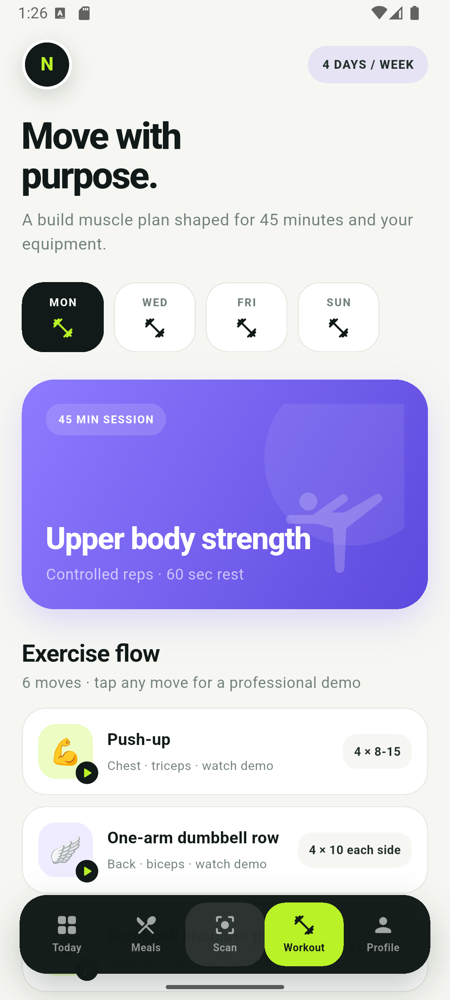
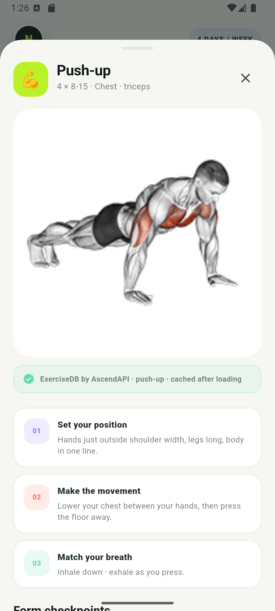

# Nourish

Nourish is a Firebase-backed Flutter app for personalized nutrition, hydration, and workout planning on Android. It combines a user's body details, goal, diet preferences, ingredient exclusions, activity, equipment, and real weekly availability into practical daily targets and plans.

## Included

- Email/password authentication, password reset, and Google sign-in
- Four-step onboarding for height, weight, age, gender, goal, diet, exclusions, activity, exact workout weekdays, session length, and equipment
- Estimated calorie, protein, carbohydrate, fibre, hydration, BMR, and BMI values with wellness guardrails
- Vegetarian, non-vegetarian, and vegan recipe filtering
- 12 Firestore recipes with complete ingredients, instructions, allergen labels, and nutrition estimates
- Goal-aware recipe ranking for fat loss, muscle building, or weight maintenance
- Camera and gallery meal scanning with Firebase AI Logic, structured food recognition, confidence and assumption review, portion correction, and calorie/macro/fibre/sugar/sodium estimates
- Sideload-safe scanning with supported Gemini fallbacks and retry messages that keep the captured photo ready
- Confirmed scanned meals added to the user's live Today totals; food photos are not stored by Nourish
- Two-to-six-day workout plans placed on the user's selected weekdays, with duration-aware exercise selection and bodyweight alternatives
- Professional ExerciseDB demonstrations for every generated exercise, with highlighted working muscles, exact source labels, disk caching, friendly retry states, and Nourish setup/action/breathing coaching
- Persistent water quick-add and undo controls backed by per-user daily Firestore records
- One-time daily-plan celebration when energy, protein, fibre, hydration, and scheduled movement are complete
- A GitHub-style yearly consistency heatmap backed by private daily completion records
- Per-user workout alarms and advance reminders on selected training weekdays, with local-time scheduling, restart recovery, live Android permission status, next-alarm countdowns, and independent disable controls
- Branded Android notifications with the Nourish raccoon logo, a dedicated audible alarm-clock channel, five-pulse vibration, and a real 10-second scheduled-alarm test
- Meal and workout logging in private per-user Firestore subcollections
- Editable profile and persistent Firebase workout plans
- Nourish raccoon branding across the app, Android splash screen, and adaptive launcher icon
- Safe-area-aware, responsive Material 3 interface for modern Android devices

## Screenshots

<p align="center">
  
  &nbsp;&nbsp;
  
</p>

## Exercise demonstrations

Nourish uses the official [ExerciseDB V1 free API](https://oss.exercisedb.dev/docs) media CDN for its professional anatomical GIF demonstrations. The app stores fixed, reviewed media IDs instead of searching at runtime, credits the exact ExerciseDB movement in each guide, and caches successful downloads on the device. No RapidAPI key or subscription is required for the current non-commercial build; an internet connection is needed the first time a demonstration is opened.

ExerciseDB requires AscendAPI attribution and limits its free 180p GIF dataset to personal, educational, community, prototype, and other non-commercial use. A commercial or monetised distribution must obtain the appropriate ExerciseDB/RapidAPI plan before release. Nourish links to the provider's CDN and does not commit or redistribute its media files.

## Firebase

- Project display name: `RohitProject`
- Project ID: `rohitproject-fit-ai`
- Firestore region: `asia-south1`
- Android package: `com.rohitproject.rohit_fit_ai`

The committed Firestore rules allow authenticated users to read the shared recipe catalog and restrict profile, meal, hydration, workout, and plan data to the matching Firebase user ID. Directly installed APKs use sideload mode because Play Integrity cannot attest a package installed outside Google Play. Play-distributed builds can explicitly enable Firebase App Check with Play Integrity.

## Run and test

```sh
flutter pub get
flutter analyze
flutter test
flutter run
```

Build the Android APK with:

```sh
flutter build apk --release
```

Downloadable APKs default to sideload mode. For a Play-distributed production
build with Firebase App Check and Play Integrity enabled, use:

```sh
flutter build apk --release --dart-define=NOURISH_SIDELOAD=false
```

Nutrition and body targets are general wellness estimates, not medical advice. Recipe nutrition varies with brands, oil, preparation, and serving size. Exercise should be adjusted or stopped if pain, dizziness, or unusual discomfort occurs.
