<div align="center">
  
  <h1>Nourish</h1>
  <p><strong>Personal nutrition, intelligent meal logging, and practical movement—shaped around real life.</strong></p>
  <p>
    Nourish turns a person's body details, goal, food preferences, weekly availability, and everyday progress
    into one focused Android wellness experience.
  </p>

  <p>
    
    
    
    
    
  </p>

  <p>
    <a href="https://github.com/SparshMishra09/Nourish/releases/download/v1.11.1/Nourish-Android-v1.11.1.apk">
      
    </a>
  </p>

  <p>
    <a href="#product-tour">Product tour</a> ·
    <a href="#what-nourish-does">Features</a> ·
    <a href="#download-and-install">Install</a> ·
    <a href="#how-personalization-works">Personalization</a> ·
    <a href="#technology">Technology</a> ·
    <a href="#run-locally">Development</a>
  </p>
</div>

---

## Wellness guidance that adapts to the person

Nourish is not a static recipe list or a generic workout timer. It is a connected daily-planning product that starts by learning about the user and then keeps food, hydration, movement, reminders, and progress in one place.

The experience is designed around a simple loop:

1. **Understand the person** — height, weight, age, gender, goal, diet, excluded foods, activity, workout days, session length, and available equipment.
2. **Build a useful plan** — practical calorie and macro targets, ranked recipes, and workouts placed only on the days the user can actually train.
3. **Track real behaviour** — scanned meals, water, completed workouts, and daily-plan progress update the Today experience.
4. **Make consistency visible** — completion celebrations and a GitHub-style yearly activity view turn long-term progress into something tangible.

<p align="center">
  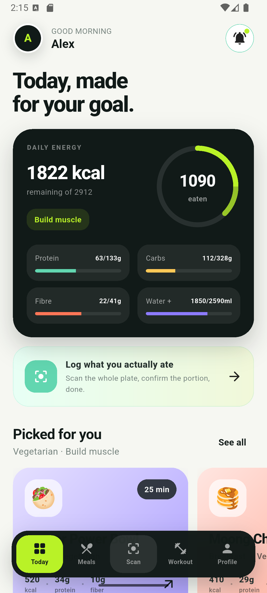
  &nbsp;
  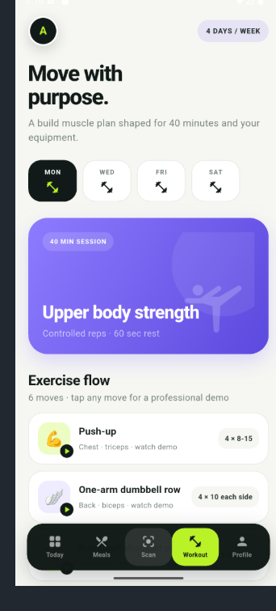
  &nbsp;
  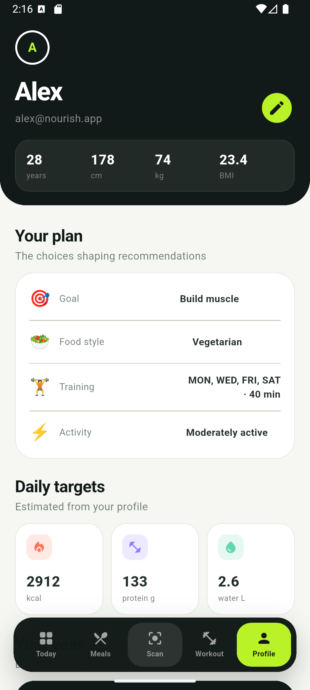
</p>
<p align="center"><sub>Current Android experience · daily guidance · personalized training · private progress</sub></p>

## Download and install

### Current Android release

| Release | APK | Android support | Package |
|---|---|---|---|
| **Nourish v1.11.1** (`versionCode 17`) | [`Nourish-Android-v1.11.1.apk`](https://github.com/SparshMishra09/Nourish/releases/download/v1.11.1/Nourish-Android-v1.11.1.apk) | Android 7.0 / API 24 or newer | `com.rohitproject.rohit_fit_ai` |

You can also use the [Cortex organization release mirror](https://github.com/Cortex-org-in/Nourish/releases/download/v1.11.1/Nourish-Android-v1.11.1.apk).

To install the APK directly:

1. Download **`Nourish-Android-v1.11.1.apk`** from the button above.
2. Open the file on the Android device.
3. If Android asks, allow installation from the browser or file manager used to open it.
4. Install Nourish, open it, and grant camera/notification permissions only when the relevant feature needs them.

> [!NOTE]
> This repository provides a release-mode APK for direct testing. Because it is installed outside Google Play, Nourish uses its sideload-safe Firebase configuration. A Play-distributed build can enable Play Integrity App Check explicitly.

## What is new in v1.11.1

- **A first-class Google sign-in experience** — the authentication card now uses Google's official full-colour mark, current neutral button colours, clearer sign-in/sign-up wording, polished spacing, accessible semantics, and a dedicated connection state without changing the proven Firebase flow.
- **Verified packaged-food scanning** — barcode and strict product matching now progress through Open Food Facts, grounded Google Search, and a source-visible public product-page fallback. Nourish uses a complete nutrition panel when available and never silently replaces a scan with a vaguely similar product.
- **Evidence before logging** — packaged scans show the matched serving, exact-product confidence, source notes, and clickable product pages before anything is added to Today.
- **A scanner that explains its work** — a polished scan-line animation moves through package reading, product matching, live-source verification, and review preparation while protecting the selected photo from accidental replacement.
- **100 complete recipes** — breakfast, lunch, dinner, snack, and simple-side collections each contain 20 unique recipes with food photography, nutrition, ingredients, allergens, and full preparation steps.
- **Better workout sessions** — optional goal- and movement-specific warm-ups and cooldowns frame every generated workout, while every planned exercise continues to open a professional ExerciseDB demonstration.

### Scanner accuracy check

The release was tested on Android with a front-only photo of a True Elements Choc 'N' Roll Almond Protein Bar and no typed hint. Nourish independently found the exact 50 g product label and returned `197 kcal`, `10.3 g protein`, `22.6 g carbohydrates`, `9 g fat`, `7.7 g fibre`, `8.1 g sugar`, and `23 mg sodium` with a 95% identity match. The result linked the [manufacturer page](https://true-elements.com/products/true-elements-choc-n-roll-almond-protein-bar-50gm-pack-of-6) and [published product label](https://www.bbassets.com/media/uploads/p/xxl/40358457-4_1-true-elements-choc-n-roll-almond-protein-bar.jpg) for review.

## Product tour

### 1. Start securely, then personalize

Users can sign in with email/password or Google. New accounts move into a four-part onboarding experience that gathers only the information needed to shape nutrition and workouts.

<p align="center">
  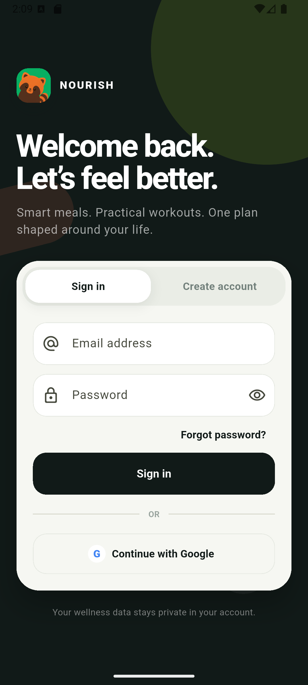
  &nbsp;&nbsp;
  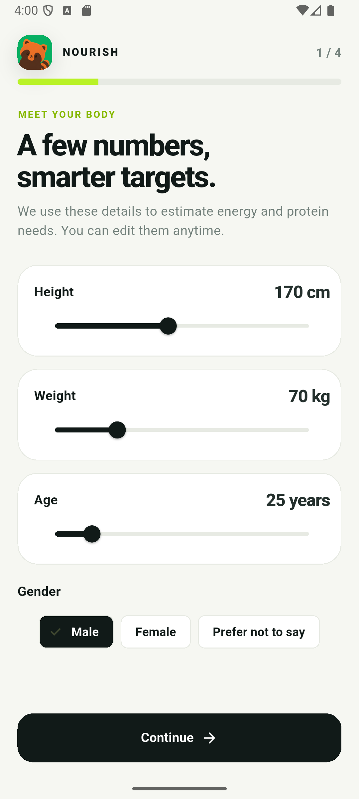
</p>
<p align="center"><sub>Private account access · body-aware onboarding</sub></p>

The onboarding flow covers:

- height, weight, age, and gender;
- fat loss, muscle building, or weight maintenance;
- vegetarian, non-vegetarian, or vegan food styles;
- ingredient exclusions and dietary customizations;
- everyday activity level;
- the exact weekdays available for training;
- preferred session duration and available equipment.

### 2. See today at a glance

The Today screen brings energy, protein, carbohydrates, fibre, hydration, meals, recommended recipes, and workout momentum into one view. The plan is calculated from the profile rather than using a single target for everyone.

<p align="center">
  
  &nbsp;
  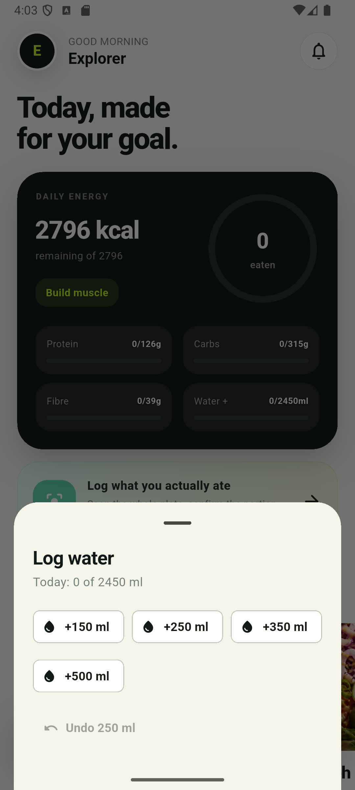
  &nbsp;
  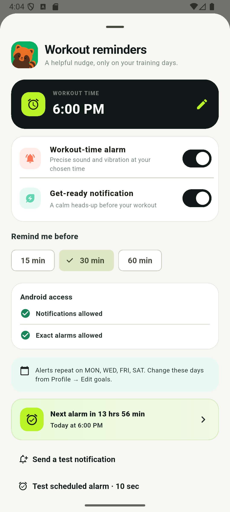
</p>
<p align="center"><sub>Live daily targets · useful hydration controls · workout reminders with exact-alarm status</sub></p>

Hydration is intentionally lightweight: users can add 150, 250, 350, or 500 ml in one tap and undo the last 250 ml when needed. The value is stored in the user's private daily Firestore record and immediately updates the Today card.

Workout reminders support:

- a precise workout-time alarm with sound and a five-pulse vibration pattern;
- a calm advance notification 15, 30, or 60 minutes beforehand;
- the user's selected training days only;
- visible Android notification and exact-alarm access state;
- a human-readable next-alarm countdown;
- separate controls for the alarm and advance notification;
- test notification and real scheduled-alarm checks;
- recovery after device restart or app update.

### 3. Make food guidance actionable

Recipes are ranked for the user's goal and diet. Every recipe opens into a complete cooking view with time, servings, dietary tags, estimated nutrition, allergens, ingredients, and step-by-step preparation.

<p align="center">
  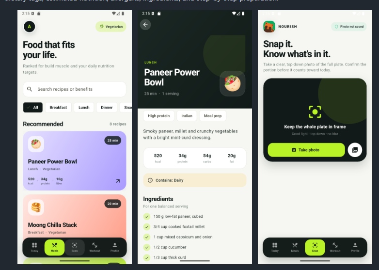
</p>
<p align="center"><sub>Latest meal experience · goal-aware discovery · full recipes · camera and gallery scanning</sub></p>

The AI meal scanner is built around what the user actually ate—not what they planned to eat. A clear meal photo can be analysed into:

- detected foods and estimated portion;
- calories;
- protein, carbohydrates, and fat;
- fibre and sugar;
- sodium;
- confidence, assumptions, and review notes.

The user confirms or corrects the portion before saving. Confirmed nutrition is added to the live Today totals. Nourish does **not** save the captured food photo to its database.

Packaged food uses an additional verification pipeline so a visual guess does not silently become a label value:

1. Nourish reads the exact brand, product variant, flavour, serving clue, and visible barcode.
2. A barcode lookup is attempted against the live Open Food Facts product-label database.
3. Without a readable barcode, Nourish performs a strict brand-and-variant match and rejects merely similar products.
4. If no strong structured match exists, Firebase AI can use grounded Google Search to find the exact current product label.
5. If grounded search is unavailable, Nourish performs an exact-name public search, opens the matching product pages, and reads their current nutrition-panel images with the vision model. Unsupported images and incomplete labels are rejected.
6. If the identity, serving, primary nutrients, or supporting sources remain ambiguous, the original result stays clearly marked as a **visual estimate**.

Verified scans show the matched serving, identity confidence, source links, and Google Search suggestions when applicable. Users can inspect that evidence before adding anything to Today. Product recipes and labels can differ by flavour and country, so Nourish always asks the user to confirm the exact package and number of servings.

While verification runs, a staged scan animation explains whether Nourish is reading the package, matching the product, checking live sources, or preparing the review. Camera and gallery controls are temporarily locked to prevent accidental replacement of the image mid-scan.

### 4. Turn workout plans into followable sessions

Nourish creates two-to-six-day workout plans on the user's chosen weekdays. Exercise selection responds to goal, session length, and available equipment, with bodyweight alternatives where appropriate.

<p align="center">
  
  &nbsp;&nbsp;
  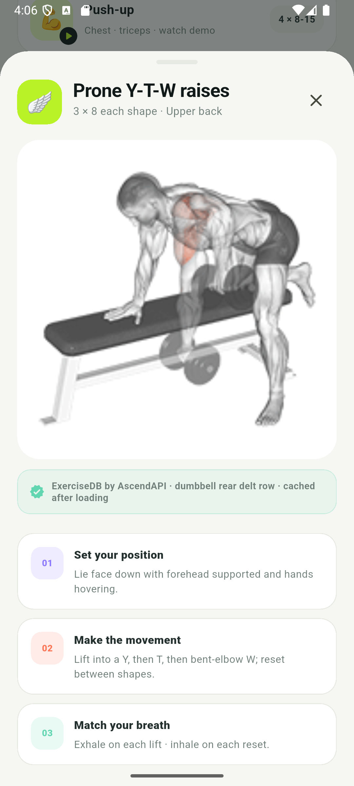
</p>
<p align="center"><sub>Day-by-day programming · professional anatomical demonstrations with coaching</sub></p>

Every generated exercise opens a professional ExerciseDB demonstration plus Nourish coaching for setup, movement, breathing, checkpoints, common mistakes, and safety. Demonstrations are cached after the first successful load so repeat viewing is fast and resilient.

### 5. Reward the whole day, not one isolated metric

Nourish considers the daily plan complete when energy is within a practical range and protein, fibre, hydration, and planned movement are ready. That moment receives a one-time in-app celebration and becomes a highlighted day in the yearly consistency view.

<p align="center">
  
  &nbsp;
  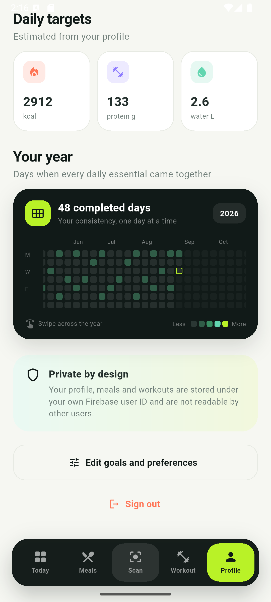
  &nbsp;
  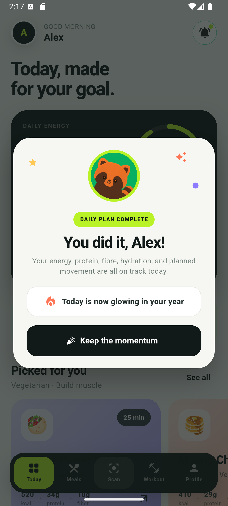
</p>
<p align="center"><sub>Editable plan · private yearly history · a clear moment of progress</sub></p>

## What Nourish does

| Product area | Capability |
|---|---|
| **Account** | Email/password registration and sign-in, password reset, Google authentication, and private per-user data |
| **Onboarding** | Four focused stages for body details, goal, diet, activity, weekly availability, session length, and equipment |
| **Personal targets** | Estimated calories, protein, carbohydrates, fibre, water, BMR, and BMI with practical wellness guardrails |
| **Meal discovery** | Vegetarian, non-vegetarian, and vegan filtering plus goal-aware ranking and ingredient exclusions |
| **Recipes** | 100 offline-first/Firestore recipes—20 each for breakfast, lunch, dinner, snacks, and simple sides—with original food photography, nutrition, allergens, measured ingredients, cooking time, servings, and complete instructions |
| **AI meal scan** | Camera/gallery input, plate estimation, strict barcode/product matching, live Open Food Facts labels, grounded web verification with visible sources, portion review, and Today logging |
| **Hydration** | Persistent quick-add, target progress, and undo controls for the current day |
| **Workout planning** | Two-to-six-day programs aligned to exact available weekdays, duration, goal, and equipment |
| **Exercise guidance** | Professional ExerciseDB demonstrations for all generated movements plus written technique coaching |
| **Workout completion** | Per-user workout logging and live weekly progress |
| **Reminders** | Training-day alarms, advance notifications, permission health, countdowns, tests, and restart recovery |
| **Daily completion** | Balanced energy/macro/hydration/movement evaluation with a one-time celebration |
| **Consistency** | GitHub-inspired yearly completion heatmap stored under the authenticated user |
| **Profile** | Editable goals/preferences, calculated BMI and targets, plan summary, privacy explanation, and sign-out |

## How personalization works

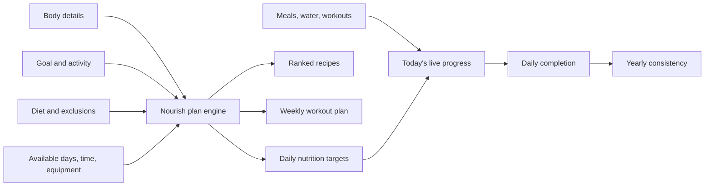

### Nutrition estimates

Nourish uses profile inputs to estimate basal metabolic rate and activity-adjusted maintenance energy. The selected goal then applies a conservative adjustment for fat loss, muscle building, or maintenance. Protein, carbohydrates, fibre, and hydration targets are derived from body weight and energy needs.

These numbers are intentionally presented as wellness estimates. They are not a diagnosis, prescription, or replacement for individualized advice from a qualified health professional.

### Recipe ranking

The recommendation engine first enforces diet and excluded-ingredient constraints, then scores eligible recipes for the user's goal and nutrition priorities. Daily suggestions rotate through the eight strongest matches for meaningful variety, while the complete 100-recipe catalog remains searchable and filterable by meal type. The catalog includes 20 unique options for each main meal category plus 20 quick, optional side dishes. Sides remain in discovery and never replace breakfast, lunch, dinner, or snacks in the daily plan. Dedicated exclusions cover dairy, egg, gluten, peanut, soy, fish, shellfish, sesame, and tree nuts.

### Workout construction

The planner places sessions only on the exact weekdays selected by the user. It chooses a balanced split, adapts set/rep details to the available duration, and substitutes movements based on equipment. Every exercise name emitted by the planner has a matching coaching guide and professional demonstration.

## Product principles

- **Useful over overwhelming.** Today focuses on the few numbers and next actions that matter.
- **Real behaviour over idealized plans.** Scanned meals and logged movement drive progress.
- **Flexible, not punishing.** Energy completion uses a practical range instead of demanding an exact calorie value.
- **Explain the recommendation.** Goals, diet, training days, targets, and source attribution stay visible.
- **Private by default.** Personal records live below the authenticated Firebase user ID and Firestore rules prevent cross-user reads.
- **Friendly failures.** User-facing errors explain what can be tried next without exposing implementation messages or stack traces.

## Data and privacy

Nourish uses Firebase Authentication and Cloud Firestore. The committed security rules allow authenticated users to read the shared recipe catalog while restricting profiles, meals, hydration, workout logs, reminder preferences, completion history, and workout plans to their matching user ID.

Important privacy behaviour:

- food photos are analysed but are not stored by Nourish;
- packaged-food identity text and barcodes may be checked against Open Food Facts, grounded Google Search, and exact-name public product pages to verify a current label; the captured food photo itself is not sent to public-search sites;
- personal progress is separated by Firebase UID;
- reminder configuration is backed up per user while alarms remain local to the Android device;
- the app requests camera, notification, and exact-alarm capabilities in context;
- direct-install builds use sideload-safe App Check behaviour because Play Integrity cannot attest an APK installed outside Google Play.

## Exercise demonstrations

Nourish uses the official [ExerciseDB V1 free API](https://oss.exercisedb.dev/docs) media CDN for professional anatomical GIF demonstrations. The app stores fixed, reviewed media IDs instead of searching at runtime, shows the exact ExerciseDB source name, credits **ExerciseDB by AscendAPI**, and caches successful downloads on the device.

No RapidAPI key or subscription is required for this current non-commercial build. An internet connection is needed the first time a demonstration is opened.

> [!IMPORTANT]
> ExerciseDB limits its free 180p GIF dataset to personal, educational, community, prototype, and other non-commercial use. A commercial or monetized Nourish distribution must obtain the appropriate ExerciseDB/RapidAPI plan before release. Nourish links to the provider CDN and does not commit or redistribute the GIF files.

## Technology

| Layer | Technology |
|---|---|
| Client | Flutter and Dart, Material 3 |
| Platform | Android, minimum API 24, target API 36 |
| Authentication | Firebase Authentication and Google Sign-In |
| Database | Cloud Firestore (`asia-south1`) |
| AI analysis | Firebase AI Logic with supported Gemini fallbacks and grounded Google Search |
| Product labels | Open Food Facts barcode/search APIs plus source-visible public product-page label reading with strict identity matching |
| Camera/gallery | `image_picker` |
| Notifications | `flutter_local_notifications`, timezone-aware local scheduling |
| Exercise media | ExerciseDB by AscendAPI and `cached_network_image` |
| App integrity | Firebase App Check with sideload and Play-distribution modes |

### Firebase project

| Setting | Value |
|---|---|
| Display name | `RohitProject` |
| Project ID | `rohitproject-fit-ai` |
| Firestore region | `asia-south1` |
| Android package | `com.rohitproject.rohit_fit_ai` |

### Architecture

```text
lib/
├── core/       Theme and visual system
├── models/     User profile, recipes, workouts, reminders, food analysis
├── screens/    Authentication, onboarding, Today, meals, scan, workout, profile
├── services/   Auth, Firestore, AI analysis, notifications, plan engine
└── widgets/    Shared UI, recipe cards, reminders, exercise guides, heatmap, celebration
```

The UI is intentionally separated from Firebase and recommendation logic. `HomeShell` composes the live product experience from streams supplied by `FirestoreService`, while `PlanEngine` remains deterministic and directly testable.

## Run locally

### Prerequisites

- Flutter SDK compatible with Dart `^3.11.3`
- Android Studio or Android SDK command-line tools
- an Android emulator or physical device running API 24+
- access to the configured Firebase project for cloud-backed features

### Install dependencies

```sh
flutter pub get
```

### Check the project

```sh
flutter analyze
flutter test
```

### Run on Android

```sh
flutter run
```

### Build the direct-install release APK

```sh
flutter build apk --release
```

The generated file is:

```text
build/app/outputs/flutter-apk/app-release.apk
```

For a Play-distributed production build with Firebase App Check and Play Integrity enabled:

```sh
flutter build apk --release --dart-define=NOURISH_SIDELOAD=false
```

## Testing and quality

The automated suite covers the product logic and the most failure-prone UI contracts:

- personalized calorie, macro, hydration, and BMI calculations;
- diet/allergen recipe filtering and goal-aware ranking;
- workout placement against exact user availability;
- complete exercise coaching and professional-demo coverage;
- daily goal requirements, including scheduled versus rest days;
- reminder confirmation, permission messaging, and alert breakdowns;
- yearly heatmap layout and completion reporting;
- exercise demonstration loading and attribution;
- packaged-food identity rejection, per-serving label conversion, incomplete-label handling, and web-source fallback;
- staged scanner-animation rendering and progress messaging;
- complete 100-recipe catalog integrity, photography, and meal-plan coverage;
- workout-specific optional warm-up and cooldown construction.
- Google authentication button wording, interaction, disabled state, and connection-state rendering.

Before packaging the current release:

```text
flutter analyze  → no issues
flutter test     → 49 tests passed
Android QA       → auth, onboarding, live data, water, reminders, meals,
                   recipes, scan, workouts, demos, profile, heatmap,
                   completion celebration, web-label evidence, scanner animation,
                   and offline media cache checked
```

## Product boundaries

- Meal analysis is an estimate and depends on image quality, visible ingredients, and accurate portion confirmation.
- Recipe nutrition varies with brands, preparation, and serving size.
- Body and nutrition targets are general wellness estimates, not medical advice.
- Users should stop or adapt exercise when experiencing pain, dizziness, or unusual discomfort.
- Reliable exact alarms depend on the Android device granting notification and exact-alarm access; some manufacturers also apply their own battery restrictions.
- ExerciseDB's free demonstration media cannot be used in a commercial/monetized distribution without the appropriate provider plan.

## Release information

**Current release:** `v1.11.1`<br />
**APK name:** `Nourish-Android-v1.11.1.apk`<br />
**Build:** `1.11.1+17`<br />
**SHA-256:** `059B95B8E7A8A37AFDC26A60DB5F53AA6953498B36AB7AA23FCDBE407A630011`

Release downloads:

- [Primary GitHub release](https://github.com/SparshMishra09/Nourish/releases/tag/v1.11.1)
- [Cortex organization mirror](https://github.com/Cortex-org-in/Nourish/releases/tag/v1.11.1)

## Contributing

Keep product changes consistent with the existing visual system and privacy model. Before opening a pull request:

1. run `dart format` on changed Dart files;
2. run `flutter analyze`;
3. run `flutter test`;
4. verify the affected flow on an Android device or emulator;
5. never commit service-account keys, user data, captured food photos, or release signing secrets.

---

<div align="center">
  
  <p><strong>Nourish the day. Build the rhythm.</strong></p>
  <p><sub>Made with Flutter and Firebase for Android.</sub></p>
</div>
